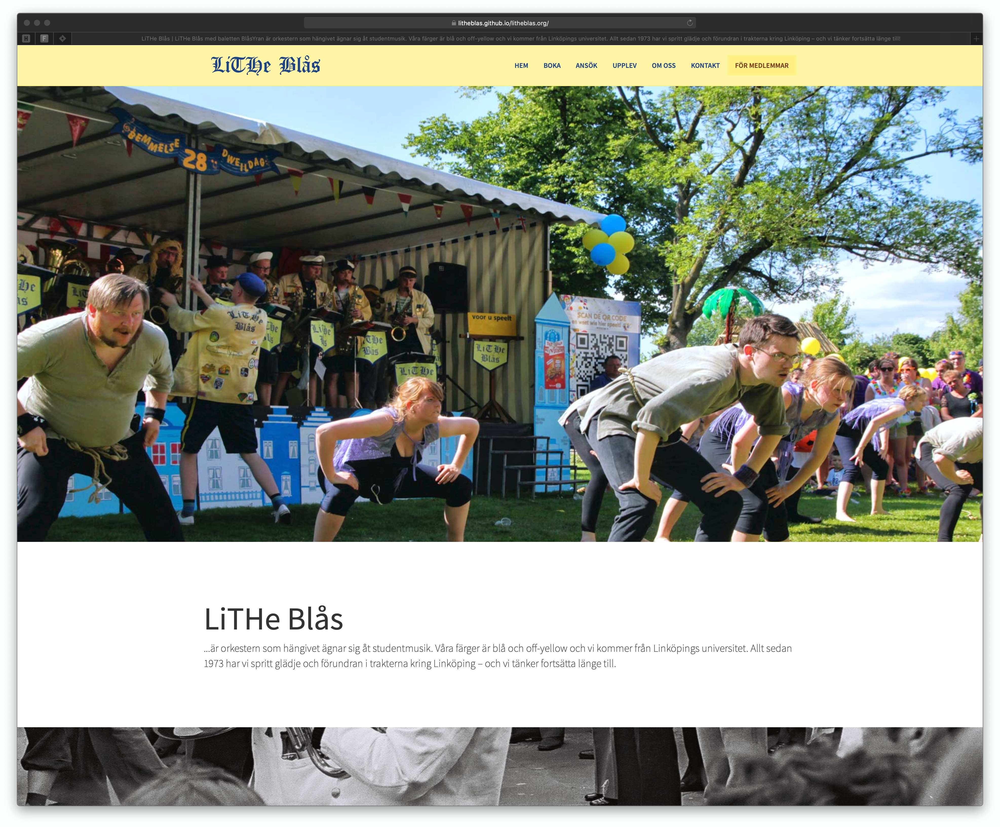

# LiTHe Blås (litheblas.org)
The external site for the student orchestra LiTHe Blås. The site is built with Jekyl and Bootstrap. Keep it simple.

## Deploy
The site is hosted on GitHub Pages. To make updates you just need to update the correct page/markdown page and push it to the master branch. The site should be rebuilt and deployed in a couple of moments.

## Development
1. Install the requirements for Jekyll (https://jekyllrb.com/docs/installation/#requirements)
2. Clone down the project localy.
3. Run `bundle install`.
4. Run `bundle exec jekyll serve`.